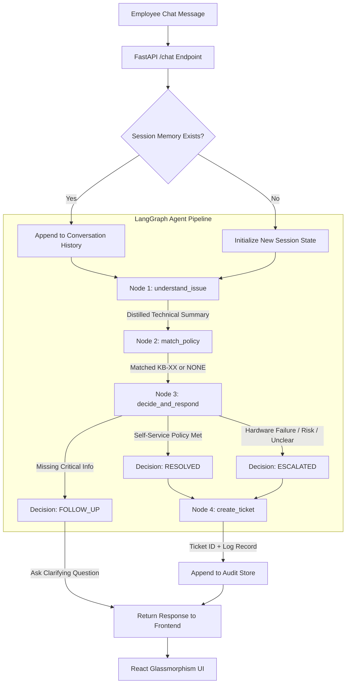

# 🛠️ Veridian Corp — Autonomous IT Support Agent

> **AIONOS Agentic AI Factory — Assignment 2: Internal Service Agent**  
> An autonomous multi-turn IT support agent built with **LangGraph**, **FastAPI**, and **React**. The agent ingests employee issues, verifies policies across 10 official IT knowledge base articles, asks clarifying follow-up questions when information is missing, auto-resolves eligible requests, safely escalates risky or hardware failures, and maintains an auditable structured ticket trail.

---

## 📌 Submission Deliverables Quick Links

| Deliverable | Location / Link |
|---|---|
| 🎥 **Demo Video (Google Drive)** | [Watch Demo on Google Drive](https://drive.google.com/) *(Open Access)* |
| 🌐 **Live Web Application (Render)** | [Launch Veridian IT Support Agent](https://it-support-agent-zjy1.onrender.com) |
| 📊 **10-Slide Presentation Deck** | [Download Presentation PPTX](./presentation/IT_Support_Agent_Presentation.pptx) |
| 🧪 **Backend Test Suite Results** | [View Test Scenarios](./tests/backend_tests.md) |

---

## 🎯 Assignment 2 Requirements Checklist

| Requirement | Implementation Status | How it is Achieved |
|---|:---:|---|
| **Understand employee issue** | ✅ Complete | Node 1 (`understand_issue`) extracts technical symptoms, device details, and error messages across multi-turn chat. |
| **Find relevant policy/resolution** | ✅ Complete | Node 2 (`match_policy`) matches inquiry against 10 KB articles (`KB-01` to `KB-10`) or marks `NONE`. |
| **Ask sensible follow-up questions** | ✅ Complete | Dynamic `FOLLOW_UP` state triggers targeted clarifying questions without repeating already answered details. |
| **Resolve simple requests** | ✅ Complete | Auto-resolves eligible requests (`RESOLVED`) with exact step-by-step guidance from policy. |
| **Escalate risky or unclear requests** | ✅ Complete | Escalates hardware failures, security incidents, or unverified claims (`ESCALATED`) with priority ranking. |
| **Create a structured ticket** | ✅ Complete | Emits ticket JSON with unique ID, timestamp, employee info, KB policy source, decision, and resolution. |
| **Show source used for answer** | ✅ Complete | Visual badge (`📚 KB-XX`) displayed on chat messages and recorded in ticket audit trail. |
| **Maintain an audit trail** | ✅ Complete | Live interactive ticket queue retaining pre-existing enterprise tickets plus newly created agent tickets. |

---

## 🏗️ System Architecture & Process Flow



---

## 🧠 LangGraph 4-Node Agent Pipeline

1. **`understand_issue(state)`**:
   - Synthesizes user messages across conversation turns.
   - Filters out conversational noise and extracts concrete facts: device type, operating system, error codes, age of hardware, and steps already attempted.
2. **`match_policy(state)`**:
   - Compares the distilled issue against the 10 official Knowledge Base articles.
   - Outputs the exact policy identifier (e.g., `KB-03`) or `NONE` if unsupported.
3. **`decide_and_respond(state)`**:
   - Determines the operational decision: `RESOLVED`, `ESCALATED`, or `FOLLOW_UP`.
   - **Anti-Repetition Engine:** Checks conversation history to prevent re-asking questions already answered by the employee.
   - Applies dual-policy validation (e.g., KB-03 hardware replacement eligibility + Asset Management 4-year refresh cycle requirement for Finance sign-off).
4. **`create_ticket(state)`**:
   - Auto-generates an immutable structured ticket payload with an audit-ready schema.

---

## 📚 Knowledge Base Policies (Veridian Corp)

| ID | Title | Scope | Action |
|---|---|---|---|
| **KB-01** | Account Lockout Policy | 5 failed attempts = 30-min lock; self-service reset portal | Auto-Resolve |
| **KB-02** | VPN Setup & MFA | GlobalProtect client configuration & Duo Mobile MFA | Auto-Resolve |
| **KB-03** | Laptop Hardware Replacement | Replaced if >3 yrs with verified hardware failure; <4 yrs requires Finance sign-off | Follow-up / Resolve / Escalate |
| **KB-04** | Software Installation Requests | Approved catalog vs. unapproved apps requiring IT Security approval | Resolve / Escalate |
| **KB-05** | Shared Office Printers | Paper jam / spooler troubleshooting; technician dispatch if unresolved | Follow-up / Escalate |
| **KB-06** | Wi-Fi Connectivity & Guest Access | Enterprise 802.1X configuration & temporary guest vouchers | Auto-Resolve |
| **KB-07** | Peripheral Allocation | Monitors, docks, keyboards via IT catalog; dual-monitor manager sign-off | Auto-Resolve |
| **KB-08** | Email Forwarding & Security | Automatic external forwarding prohibited per SecOps policy | Auto-Resolve (Deny) |
| **KB-09** | Mobile Device Management (MDM) | Intune enrollment required for corporate email on personal phones | Auto-Resolve |
| **KB-10** | Emergency Security Incidents | Phishing clicks, malware alerts, stolen hardware; immediate Sev-1 isolation | Urgent Escalate |

---

## 🛠️ AI Tooling & Technical Stack

| Layer | Tool / Framework | Role & Rationale |
|---|---|---|
| **LLM Reasoning** | **Groq — `llama-3.3-70b-versatile`** | Ultra-low latency (~300ms) with 70B parameter precision for strict policy compliance and zero hallucinations. `temperature=0` ensures deterministic outputs. |
| **Agent Orchestration** | **LangGraph + LangChain** | StateGraph machine enabling cyclical multi-turn conversations, conditional branching, and explicit state schemas. |
| **Backend API** | **FastAPI + Uvicorn** | High-performance asynchronous REST API with auto-generated OpenAPI/Swagger documentation. |
| **Frontend Interface** | **React 19 + Vite** | Responsive dark-mode glassmorphic UI, real-time ticket badge synchronization, quick-fill employee switcher. |
| **Production Server** | **Unified Single-Service** | FastAPI serves both API routes and the compiled React SPA from a single deployment instance. |

---

## 🎫 Structured Ticket Schema

Every finalized interaction generates a structured ticket logged into the audit store:

```json
{
  "ticket_id": "TK-B8F31E",
  "employee_name": "Marcus Vance",
  "employee_email": "m.vance@veridian.com",
  "issue_summary": "Laptop completely dead, no lights. Motherboard failure verified by technician. Age 3.5 years.",
  "kb_used": "KB-03",
  "decision": "resolved",
  "resolution": "Replacement authorized under KB-03 with verified failure. Finance sign-off submitted as age is under 4-year refresh cycle.",
  "timestamp": "2026-09-18T14:35:10Z"
}
```

---

## 🧪 Test Scenarios & Evaluation Summary

| # | Test Scenario | Employee Input | Agent Decision | KB Used | Expected Behavior |
|---|---|---|:---:|:---:|---|
| **1** | **Password Lockout** | *"Locked out after 5 attempts"* | `RESOLVED` | `KB-01` | Explains 30-min lockout rule & self-service reset. |
| **2** | **Laptop Replacement** | *"Laptop won't turn on, had it 3.5 years"* | `FOLLOW_UP` → `RESOLVED` | `KB-03` | Clarifies hardware failure; confirms KB-03 eligibility + Finance sign-off requirement. |
| **3** | **Hardware Printer** | *"Printer jammed, restarted spooler, still broken"* | `ESCALATED` | `KB-05` | Dispatches technician with High priority. |
| **4** | **Unapproved App** | *"Need Figma desktop installed"* | `RESOLVED` | `KB-04` | Directs to software catalog and approval workflow. |
| **5** | **Phishing Incident** | *"Clicked suspicious email attachment"* | `ESCALATED` | `KB-10` | Urgent Sev-1 alert to SecOps; instructs network disconnect. |

*(Detailed execution logs and transcripts available in [tests/backend_tests.md](file:///d:/HDD/HDD/ENGINEERING/15_AINOSAI_PROJECT_NITA/IT-support-agent/tests/backend_tests.md))*

---

## 🚀 Running Locally

### 1. Prerequisites
- Python 3.10+
- Node.js 18+
- Free Groq API Key ([console.groq.com](https://console.groq.com))

### 2. Clone Repository
```bash
git clone https://github.com/your-username/IT-support-agent.git
cd IT-support-agent
```

### 3. Backend Setup
```bash
cd backend
python -m venv .venv
# On Windows:
.\.venv\Scripts\activate
# On Mac/Linux:
source .venv/bin/activate

pip install -r requirements.txt

# Create .env file with your Groq API key:
echo GROQ_API_KEY=your_actual_groq_api_key_here > .env

# Run FastAPI server:
uvicorn main:app --reload --port 8000
# Backend API: http://localhost:8000
# Swagger Docs: http://localhost:8000/docs
```

### 4. Frontend Setup
```bash
cd ../frontend
npm install
npm run dev
# Frontend UI: http://localhost:5173
```

---

## ☁️ Deployment on Render (Unified Single-Service)

This repository includes a `render.yaml` configuration that deploys both the backend and frontend together as a single Render Web Service.

### 1-Click Setup:
1. Push this repository to your GitHub account.
2. Log into [Render.com](https://render.com) and click **New +** → **Blueprint**.
3. Select your `IT-support-agent` repository.
4. Set the environment variable:
   - `GROQ_API_KEY`: `your_groq_api_key_here`
5. Click **Apply**! Render will automatically:
   - Install Python dependencies
   - Serve the React UI at root `/`
   - Handle API requests at `/chat` and `/tickets`

---

## 👥 Contributors & Acknowledgements
- **Author:** Candidate Submission for AIONOS Agentic AI Factory
- **Frameworks:** LangGraph, LangChain, Groq, FastAPI, React
